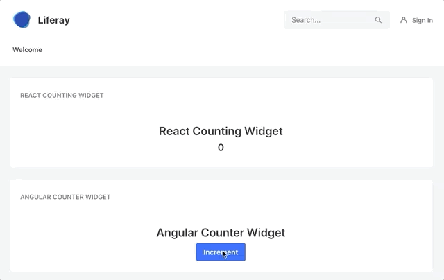

# Micro Frontends in Liferay 7
Demonstration of [Micro Frontends](https://micro-frontends.org/) in Liferay 7.1 with Angular & React.

## Requirements

`Liferay JS Portlet Extender` must be installed. You can find CE Version [here](https://web.liferay.com/fr/marketplace/-/mp/application/115542926) and DXP Version [here](https://web.liferay.com/fr/marketplace/-/mp/application/115543020).

## Step by step

Git branches will help you to follow important steps in the process of building this architecture:

- `steps/01-init-angular-widget`: create a counter widget with Angular.
- `steps/02-deduplication`: create a new module that provides dependencies and thus lighten our widgets. 
- `steps/03-react-angular-communication`:  create a counting widget with React that communicates with our previous Angular widget to use its capabilities. 

`master` is the final result of all these steps (_i.e._ its state is identical to the last step).

## License
[MIT](LICENSE)
